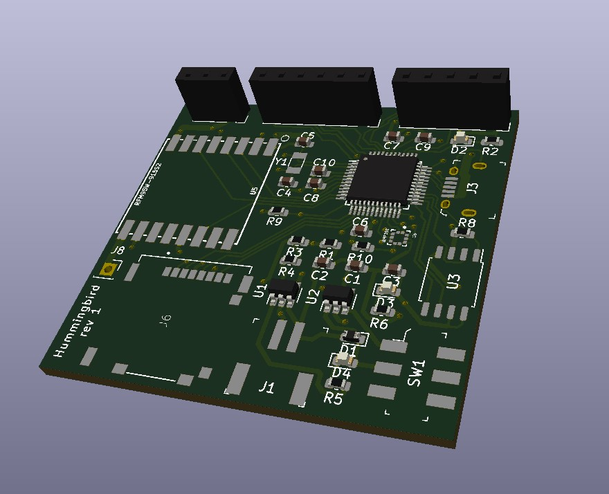

```
 _   _ _   _ __  __ __  __ ___ _   _  ____ ____ ___ ____  ____  
| | | | | | |  \/  |  \/  |_ _| \ | |/ ___| __ )_ _|  _ \|  _ \ 
| |_| | | | | |\/| | |\/| || ||  \| | |  _|  _ \| || |_) | | | |
|  _  | |_| | |  | | |  | || || |\  | |_| | |_) | ||  _ <| |_| |
|_| |_|\___/|_|  |_|_|  |_|___|_| \_|\____|____/___|_| \_\____/ 
```


A lightweight device for capture altitude and other data from a kite




**r1 status:** DO NOT PLUG IN A BATTERY

## References

 - BMP388, microSD and Slide switch footprint from Digikey
 - [RFM69 Footprint](https://github.com/benwis/SparkFun-Kicad-Libraries/blob/master/SparkFun-RF.pretty/RFM69HCW-XXXS2.kicad_mod)


## Building

 The `gerbers` folder has a zip file if you want to order your own PCB.

 There is a `bom.csv` that contains all the parts and digikey part numbers you need

 There's also an `interactive_bom.html` that is from the excellent [InteractiveHtmlBom](https://github.com/openscopeproject/InteractiveHtmlBom) plugin

 ## Known Issues

 ### Rev 1

  1. **Battery connector is wired backwards**
  1. microSD footprint is backwards, so it is un-usable
  1. Battery and battery charging to do not work. I plugged one in, immediatly smelled burning. Current theory is that I forgot a current limiting resistor on the LDO's EN pin, so too much current from battery (but not from USB).